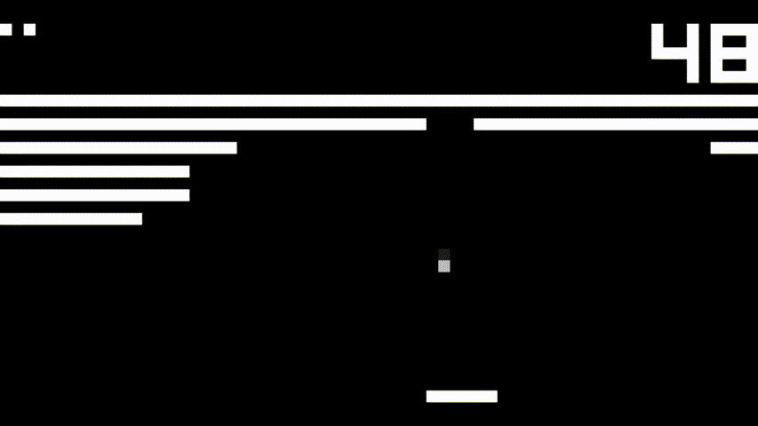

# Rust8

Rust8 is a [CHIP-8] interpreter written in Rust with graphics frontend written with [pixels] + [winit].



[CHIP-8]: https://en.wikipedia.org/wiki/CHIP-8
[pixels]: https://github.com/parasyte/pixels
[winit]: https://github.com/rust-windowing/winit

## Features

* Allows for use of [both original and modified semantics] of the CHIP-8 instructions.
* Allows for setting how many instructions will be executed per second.
* Supports loading CHIP-8 roms by drag & dropping them onto the window.

## About

My main goal with this project was diving a little bit deeper into the [crates] ecosystem while writing something fun.

[crates]: https://crates.io

## Building

```console
$ git clone https://github.com/rosowskimik/rust8.git
$ cd rust8
$ cargo build --release
```

## Usage

```console
$ rust8 --help
Rust8 0.1.0
Mikołaj Rosowski
Rust8 is a CHIP-8 interpreter

USAGE:
    rust8.exe [OPTIONS] [--] [ROM]

ARGS:
    <ROM>    Path to the ROM to load

OPTIONS:
    -c, --clock-speed <SPEED>
            Set cpu clock speed (in Hz) [default: 700]

    -h, --help
            Print help information

    -l, --use-modified-load[=<bool>...]
            Use modified FX55/FX65 operation (don't increase I by X + 1) [default: false] [possible
            values: true, false]

    -s, --use-modified-shift[=<bool>...]
            Use modified 8XY6/8XYE operation (shift VX, not VY) [default: true] [possible values:
            true, false]

    -V, --version
            Print version information
```

## Download

Prebuilt binaries for Windows, Mac and Linux are available [here](https://github.com/rosowskimik/rust8/releases).

## Input
Each key from the CHIP-8 keypad has been mapped to keyboard keys like this:

<table>
<tbody>
<tr>
<td>
  <table>
  <caption>CHIP-8 Keypad</caption>
  <tbody>
  <tr><td>1</td><td>2</td><td>3</td><td>C</td></tr>
  <tr><td>4</td><td>5</td><td>6</td><td>D</td></tr>
  <tr><td>7</td><td>8</td><td>9</td><td>E</td></tr>
  <tr><td>A</td><td>0</td><td>B</td><td>F</td></tr>
  </tbody>
  </table>
</td>
<td>
  <table>
  <caption>QWERTY Keyboard</caption>
  <tbody>
  <tr><td>1</td><td>2</td><td>3</td><td>4</td></tr>
  <tr><td>Q</td><td>W</td><td>E</td><td>R</td></tr>
  <tr><td>A</td><td>S</td><td>D</td><td>F</td></tr>
  <tr><td>Z</td><td>X</td><td>C</td><td>V</td></tr>
  </tbody>
  </table>
</td>
</tr>
</tbody>
</table>

Spacebar pauses the interpreter and escape exits the program.

## Special Thanks

* [Cowgod's Chip-8 Technical Reference](http://devernay.free.fr/hacks/chip8/C8TECH10.HTM)
* [mattmikolay's Mastering CHIP-8](https://github.com/mattmikolay/chip-8/wiki/Mastering-CHIP%E2%80%908)